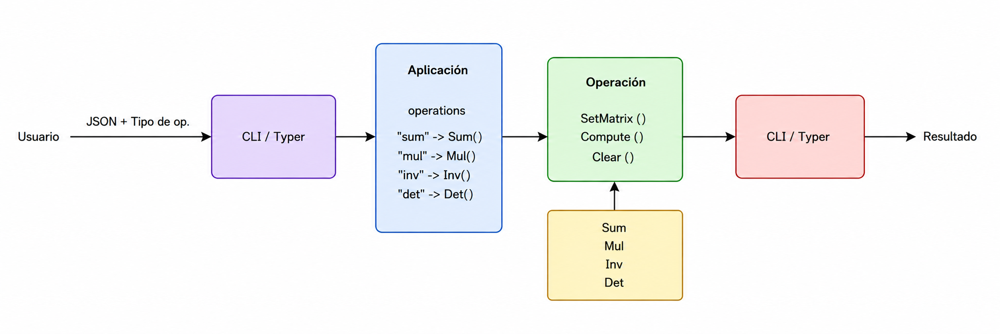

# Calculadora de Matrices en Python

## Descripción del proyecto

Este proyecto consiste en el desarrollo de una calculadora de matrices implementada en Python. La aplicación permite realizar diferentes operaciones matemáticas sobre dos matrices proporcionadas mediante un archivo en formato JSON.

Las operaciones soportadas actualmente son:

- Suma de matrices.
- Multiplicación de matrices.
- Cálculo del determinante.
- Cálculo de la inversa.

El proyecto utiliza una arquitectura basada en **Interfaz–Adaptador**, buscando separar la interfaz utilizada por el usuario de la lógica encargada de realizar las operaciones matemáticas.

Las diferentes operaciones implementan un contrato común mediante la clase `Operation`, que define los métodos:

- `SetMatrix(index, matrix)`
- `Compute()`
- `Clear()`

La clase `Application` mantiene un registro de las operaciones disponibles y permite seleccionar la operación solicitada por el usuario.

La interacción con la aplicación se realiza mediante una interfaz de línea de comandos (**CLI**) desarrollada utilizando **Typer**.

El proyecto utiliza **uv** para la gestión del entorno, dependencias y ejecución de la aplicación.

---

## Diagrama del diseño





## Estructura del proyecto

```text
laboratorio-ia-git-equipo/
├── src/
│   ├── operations/
│   │   ├── sum.py
│   │   ├── mul.py
│   │   ├── det.py
│   │   └── inv.py
│   ├── utils/
│   │   └── json_loader.py
│   ├── operation.py
│   ├── application.py
│   └── cli.py
├── matrices.json
├── pyproject.toml
├── uv.lock
├── .gitignore
└── README.md
```

### Componentes principales

**`operation.py`**  
Define la clase base `Operation` y el contrato común que deben implementar las operaciones de la calculadora.

**`operations/`**  
Contiene las implementaciones de suma, multiplicación, determinante e inversa.

**`application.py`**  
Representa la aplicación y contiene el diccionario que relaciona los nombres de las operaciones con sus respectivas instancias.

**`cli.py`**  
Implementa la interfaz de línea de comandos utilizando Typer.

**`json_loader.py`**  
Se encarga de cargar y validar las matrices recibidas mediante archivos JSON.

---

# Instrucciones de instalación

## Requisitos

Para ejecutar el proyecto se requiere:

- Python
- uv
- Git

Versiones utilizadas durante el desarrollo:

```text
Python: ______________________________
uv: ______________________________
```

## 1. Clonar el repositorio

```bash
git clone ______________________________
```

Ingresar al directorio:

```bash
cd laboratorio-ia-git-equipo
```

## 2. Instalar las dependencias

El proyecto utiliza `uv` para gestionar las dependencias.

Ejecutar:

```bash
uv sync
```

Esto instalará las dependencias especificadas en `pyproject.toml` y `uv.lock`.

---
# Instrucciones de utilización

La aplicación recibe dos matrices mediante un archivo en formato JSON. Cada matriz debe incluir sus dimensiones (`rows` y `cols`) y sus datos como un arreglo bidimensional de valores en punto flotante.

Ejemplo de `matrices.json`:

```json
{
  "matrixA": {
    "rows": 2,
    "cols": 2,
    "data": [
      [1.50, 2.33],
      [3.0, 4.456]
    ]
  },
  "matrixB": {
    "rows": 2,
    "cols": 2,
    "data": [
      [5.90, 6.01],
      [7.11, 8.677]
    ]
  }
}
```

## Consultar las operaciones disponibles

Para mostrar la ayuda de la aplicación y las operaciones disponibles:

```bash
uv run python -m src.cli --help
```

La calculadora dispone de los siguientes comandos:

- `sum`: suma de matrices.
- `mul`: multiplicación de matrices.
- `det`: determinante de ambas matrices.
- `inv`: inversa de ambas matrices.

# Ejemplos de utilización

### Suma

```bash
uv run python -m src.cli sum matrices.json
```

### Multiplicación

```bash
uv run python -m src.cli mul matrices.json
```

### Determinante

```bash
uv run python -m src.cli det matrices.json
```

### Inversa

```bash
uv run python -m src.cli inv matrices.json
```

El archivo `matrices.json` puede modificarse para utilizar otros valores y dimensiones, siempre que se respete el formato de entrada y las condiciones requeridas por cada operación.

# Validación de las matrices

Antes de ejecutar una operación, la aplicación valida los datos de entrada. Entre las principales validaciones se encuentran:

- Existencia de las matrices A y B.
- Correspondencia entre las dimensiones indicadas y los datos.
- Consistencia en la cantidad de elementos de cada fila.
- Uso de valores de punto flotante.
- Compatibilidad de dimensiones según la operación.
- Matrices cuadradas para determinante e inversa.
- Existencia de inversa para matrices no singulares.

Si alguna condición no se cumple, la aplicación genera un error indicando el problema encontrado.
## Consultar las operaciones disponibles

Para consultar la ayuda de la aplicación:

```bash
uv run python -m src.cli --help
```

La CLI mostrará las operaciones disponibles:

```text
sum
mul
det
inv
```

---

# Ejemplos de utilización

## Suma

```bash
uv run python -m src.cli sum matrices.json
```

Realiza la suma:

```text
A + B
```

## Multiplicación

```bash
uv run python -m src.cli mul matrices.json
```

Realiza la multiplicación:

```text
A × B
```

## Determinante

```bash
uv run python -m src.cli det matrices.json
```

Calcula el determinante de las matrices de forma independiente.

```text
det(A)
det(B)
```

## Inversa

```bash
uv run python -m src.cli inv matrices.json
```

Calcula la inversa de las matrices de forma independiente.

```text
A⁻¹
B⁻¹
```

Para calcular una inversa, la matriz debe ser cuadrada e invertible.

---

# Validación de las matrices

Antes de realizar las operaciones, la aplicación valida los datos proporcionados.

Entre las validaciones realizadas se encuentran:

- Existencia de las matrices A y B.
- Correspondencia entre las dimensiones indicadas y los datos.
- Consistencia en la cantidad de columnas de las filas.
- Uso de valores de punto flotante.
- Compatibilidad de dimensiones según la operación.
- Matrices cuadradas para determinante e inversa.
- Existencia de inversa para matrices no singulares.

Si alguna condición no se cumple, la aplicación genera un error indicando el problema encontrado.

---

# Tecnologías utilizadas

- **Python** — lenguaje de programación principal.
- **Typer** — implementación de la interfaz de línea de comandos.
- **uv** — gestión del proyecto, entorno y dependencias.
- **Git** — control de versiones.
- **GitHub** — alojamiento del repositorio y flujo de Pull Requests.
- **______________________________** — elaboración del diagrama de diseño.

---

# Integrantes

- ______________________________
- ______________________________

## Curso

**Curso:** ______________________________

**Profesor:** ______________________________

**Institución:** ______________________________

**Periodo:** ______________________________
